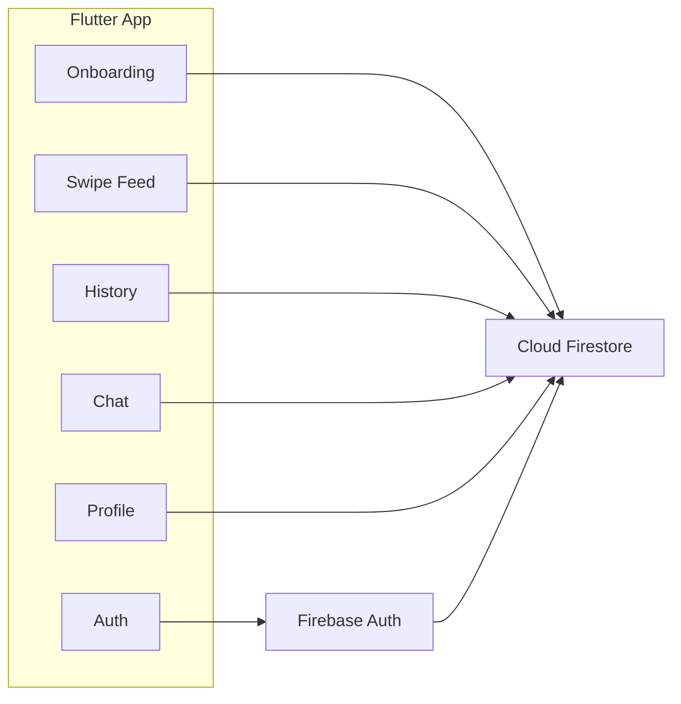

# Roomee

Roomee is a Flutter app for roommate matching. Users sign in, complete a
compatibility questionnaire, browse profiles in a swipe-based feed, and
chat after a mutual match.

## Features

- Email/password authentication with Firebase Auth
- Onboarding: name, city, and compatibility questions (sliders, choices, notes)
- Swipe feed with match percentage, like/pass, and undo queue
- Mutual likes create connections
- Chat with message stream, identity reveal, and un-connect
- Profile management with retake compatibility check
- History view for passes and connections

## Tech stack

- Flutter + Dart
- Firebase Auth
- Cloud Firestore
- FlutterFire configuration
- Google Fonts and custom theme

## Architecture

## Data model (Firestore)

- users/{uid}: name, email, city, answers, onboardingComplete, timestamps
- users/{uid}/swipes: direction, matchPercent, targetUid, createdAt
- users/{uid}/connections: connectionId, matchPercent, otherUid, createdAt
- users/{uid}/undoQueue: otherUid, createdAt
- connections/{connectionId}: members, matchPercent, createdAt
- connections/{connectionId}/messages: senderId, text, createdAt

## Getting started

### Prerequisites

- Flutter SDK (stable)
- Firebase project

### Setup

1. Install dependencies:
	 - flutter pub get
2. Configure Firebase:
	 - flutterfire configure (generates lib/firebase_options.dart)
	 - Add platform configs:
		 - android/app/google-services.json
		 - ios/Runner/GoogleService-Info.plist

### Run

- flutter run
- flutter run -d chrome (web)

### Seed demo data (optional)

In lib/main.dart, uncomment injectDummies() in main(), run once, then
comment it again.

### Tests

- flutter test

### Build

- flutter build apk
- flutter build ios
- flutter build web

## Project structure

- lib/
	- features/ (auth, onboarding, feed, chat, history, profile)
	- theme/ (app theme, colors, typography)
	- firebase_options.dart
	- main.dart
- android/, ios/, web/, windows/, macos/, linux/
- test/
